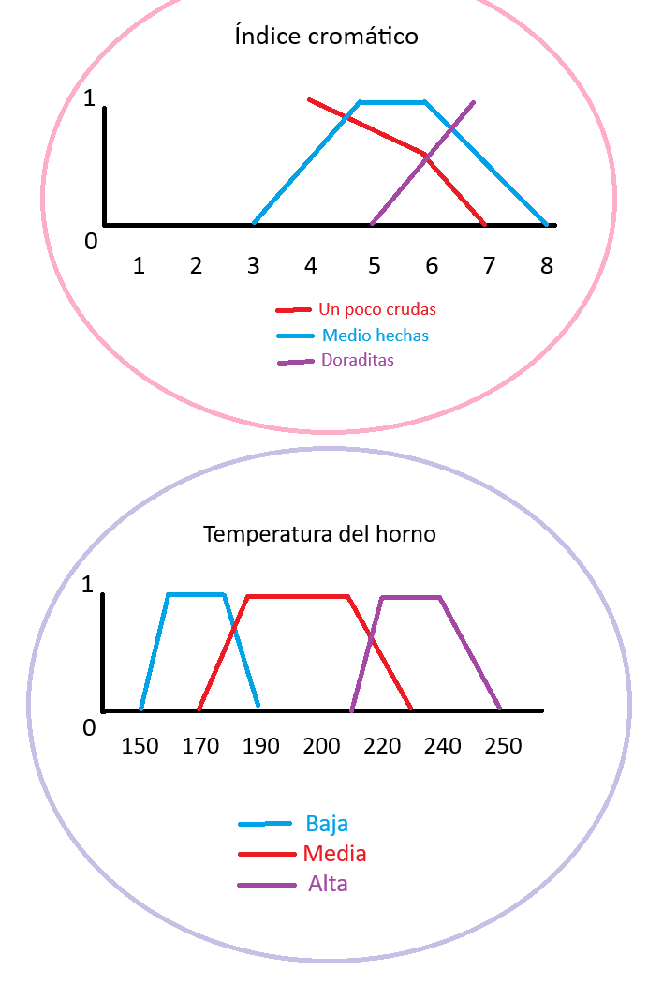

# Ejercicio-logica-difusa-Fuzzy_CLIPS

Este proyecto utiliza **FuzzyCLIPS** (una extensión lógica de CLIPS, que es un sistema experto que era usado por la NASA). En este ejercicio lo utilizaremos para realizar el razonamiento difuso sobre datos relacionados con la preparación de galletas. <br><br> Su objetivo es **automatizar la inferencia (conclusión) basada en reglas difusas predefinidas** facilitando la interpretación de resultados y la comparación de métodos de deffuzificación (proceso de convertir esos valores difusos en un único valor concreto que podamos usar).

---

<br>

## 📑 Tabla de contenido
1. [Objetivo](#objetivo)
2. [Ventajas y características](#ventajas-y-caracteristicas)
3. [Autores](#realizado-por)
4. [Gráficas de los datos](#graficas-de-los-datos)
5. [Carga de la base de conocimiento](#carga-de-la-base-de-conocimiento)
6. [Carga de la base de hechos](#carga-de-la-base-de-hechos)
7. [Inicio y ejecución del razonamiento](#inicio-y-ejecucion-del-razonamiento)
8. [Comprobación de resultados](#comprobacion-de-resultados)

---

<br>

## 🛠️ Objetivo

El proyecto busca analizar y procesar datos mediante lógica difusa, evaluando distintos métodos de defuzzificación para obtener valores óptimos según criterios definidos en la base de conocimiento.

<br>

## 🔥 Ventajas y características

- ✅ **Automatización completa** – FuzzyCLIPS procesa reglas y hechos sin intervención manual.  
- ✅ **Visualización clara** – Gráficas y tablas permiten interpretar los resultados de forma rápida y efectiva.  
- ✅ **Comparación de métodos de defuzzificación** – Se incluyen los métodos **Maximum** y **Moment (Centroide)**.  

<br>

## 👨‍💻 Realizado por

- Carlos Cerezo López

- Enrique Moreno Alcántara

> ⚠️ Nota: bc = Base conocimientos | bh = Base hechos.


<br><br>

## 📊 Gráficas de los datos



<br>

## ⚙️ Carga de la base de conocimiento

```java
FuzzyCLIPS> (load "Ejercicio_galletas/bc.clp")
Defining deftemplate: indice_cromatico
Defining deftemplate: temperatura_horno
Defining defrule: regla_1 +j
Defining defrule: regla_2 +j
Defining defrule: regla_3 +j
TRUE
```

<br>

## ⚙️ Carga de la base de hechos

```java
FuzzyCLIPS> (load "Ejercicio_galletas/bh.clp")
Defining deffacts: hechos
TRUE
```

<br>

## ▶️ Inicio y ejecución del razonamiento

Inicializamos el motor mediante ``reset`` y se ejecuta el razonamiento con ``run``.
```java
FuzzyCLIPS> (reset)
FuzzyCLIPS> (run)
```


<br>

## 🔍 Comprobación de resultados

* Método Maximum

Seleccionamos el valor con el pico máximo. ``(maximun-defuzzify)`` elige el pico más alto.
```java
FuzzyCLIPS> (maximum-defuzzify 4)
230.0
```

<br>

* Método Moment (Centroide)

Calculamos el centro de gravedad del conjunto difuso de salida. ``(moment-defuzzify)`` calcula el centro de gravedad
```java
FuzzyCLIPS> (moment-defuzzify 4)
206.25
```
